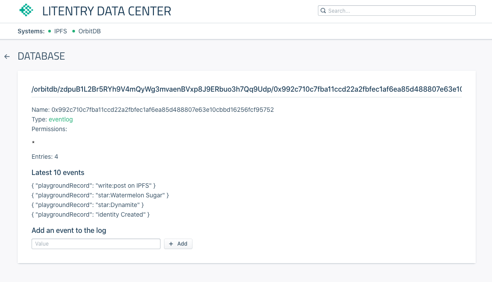

# Litentry IPFS Data Center

Github Repository: [https://github.com/litentry/litentry-ipfs-data-center](https://github.com/litentry/litentry-ipfs-data-center)

Live Site on [https://data.litentry.com/](https://data.litentry.com/)

Litentry uses OrbitDB to offer an IPFS database support. In Data Center, user may check their identity related data and tokens.

In the future we will implement Arweave and on-Chain key value storage.

