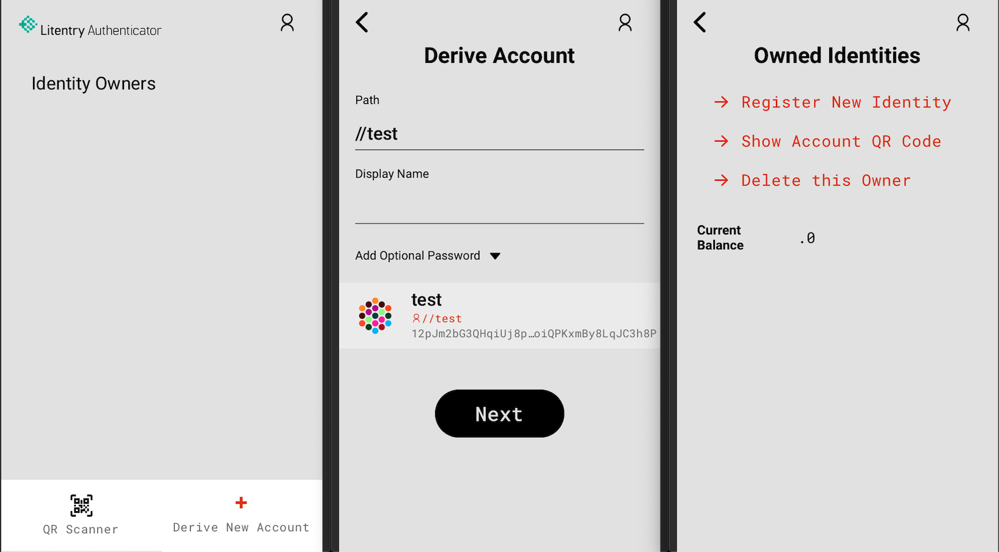
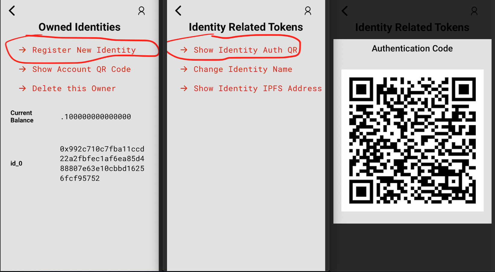
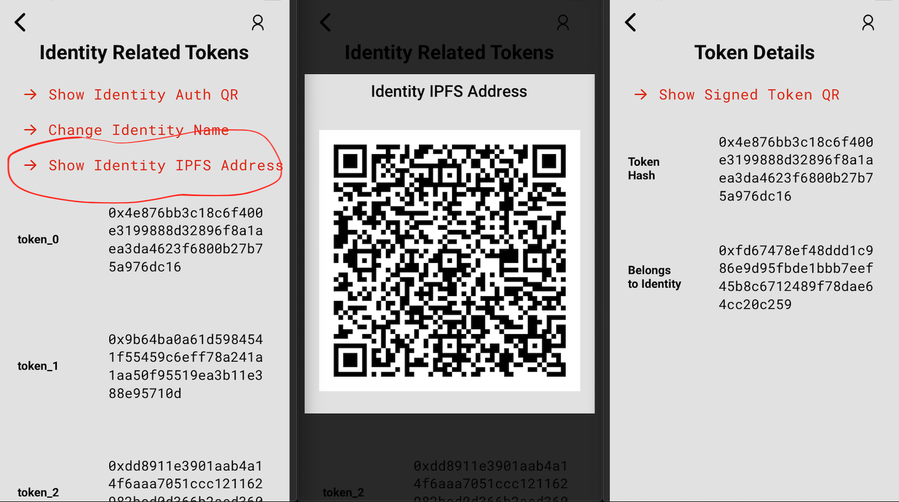

# Authentication Mobile App

Github Repository: [https://github.com/litentry/litentry-authenticator](https://github.com/litentry/litentry-authenticator)

Download Litentry Authenticator v1.1.1 Android APK [here](https://github.com/litentry/litentry-authenticator/releases/download/v1.1.1/app-release.apk)

### Mobile App Abstract
Personal users would like to use an Wallet Application to manage all its identities, it could also become a Hub connected to different interest IoT devices. For example, directly buying the authorization or the data from other IoT devices. With the advantage of GPS of mobile phone, it could further integrate with LBS (Location Based Services).

In order to work in a fully decentralized scenario, itself also need to integrate a light client, where could keep a user's private key in a secure environment provided by Android or iOS.

Mobile Application Screenshots:

For the step to step guide on use Litentry Authenticator please refer to [this article](https://www.litentry.com/post/play-litentry-dapps-with-ipfs-part-1).

#### Recover Seed and Manage Account

#### Register Identity and 2FA Authentication

#### Check Token Related Data

