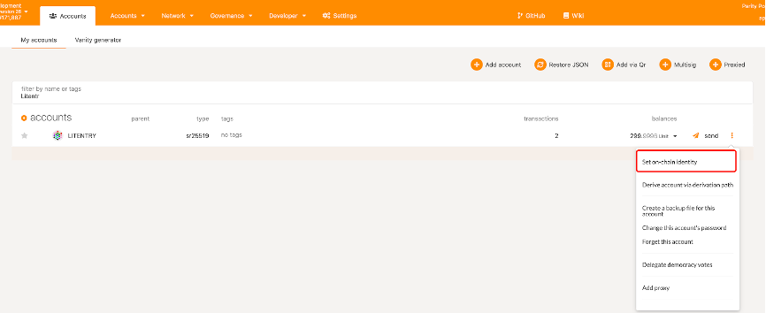
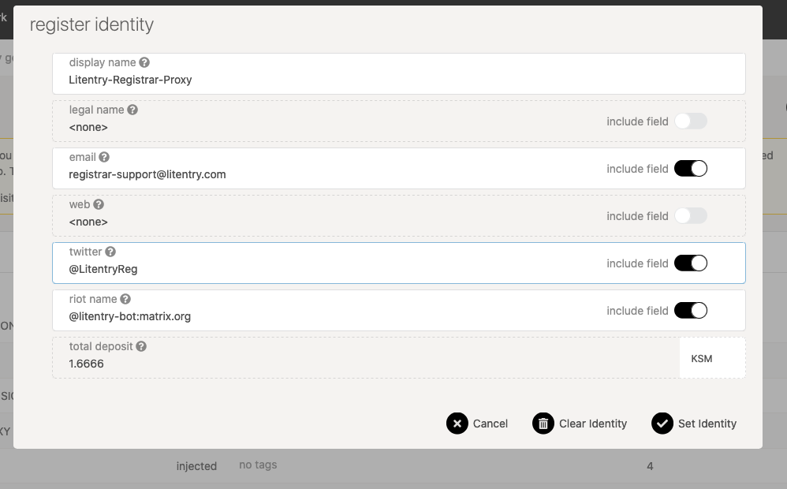
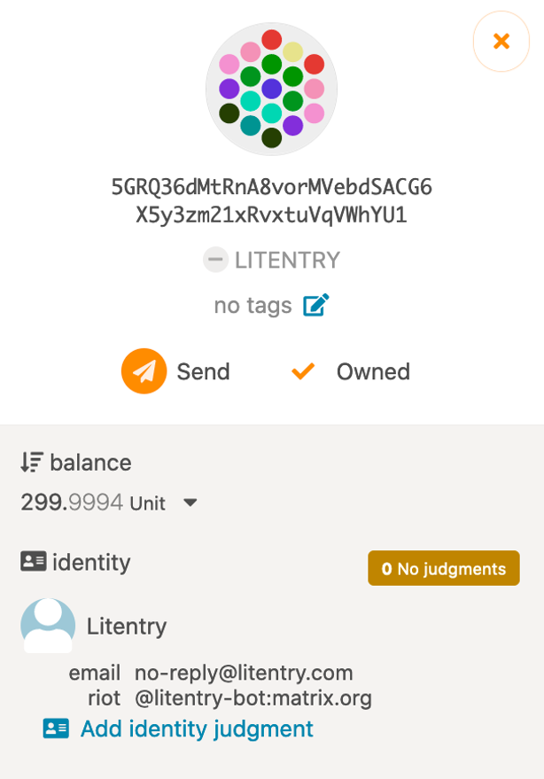
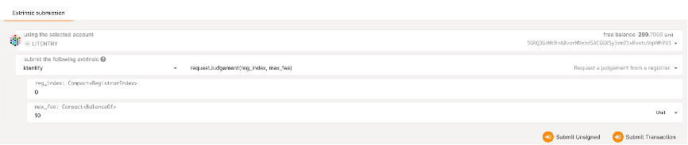
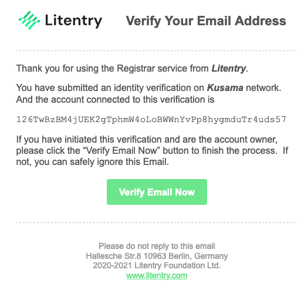
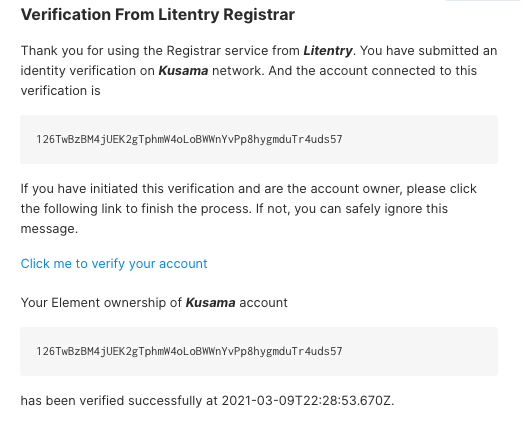

# How To Verify Your Identity

Litentry Registrar index on Kusama is 4, and the service fee is 0.04KSM. <!--- <mark>*I have not idea what this means
What is the registrar index on Kusama and what is the relevance of it being 4. How do i pay the KSM service fee? </mark> -->

**In the Twitter verification process, users need to follow the Litentry official registrar account, namely Litentry Registrar (@LitentryReg).**

## Introduction

While the anonymity Web3 provides has a great advantage in user privacy, revealing partial personal information can help gain a higher reputation and trust in the Polkadot ecosystem. This document introduces a registrar service that is fully automatic, leveraging cryptographical design to eliminate human interventions. Litentry registrar focuses on providing judgment for a user's `display name`, `email`, `twitter`, or `element name (previously called riot)`while preserving user privacy.

We will walk through the identity verification process step by step: First, users need to set their identity information on the chain; Second, they may request the registrar to verify the identity. Users will enter a maximum fee they are willing to pay for the service. After that, the dedicated registrar can ascertain.

### Step 1: Set an on-chain identity

* Go to the 'Accounts' session on [Polkadot-JS Apps](https://polkadot.js.org/apps)
* Make sure you're in the Kusama network by looking at the top left of the page. If not, click on the toggle to switch
* On the accounts list, click on the dots icon on the right side of your selected account and click `Set on-chain identity`.

Figure 1.1  Set on-chain Identity

* You'll see a popup window of 'register identity'. Click to turn on include field of display name , email , twitter , riot(also known as element) and enter your information. Once you finish, click Set Identity to submit the transaction.

Figure 1.2  Submit Identity information

Now you have successfully submitted an identity! Since your information is not verified yet, you will see a ⚪️ next to your username.

Figure 1.3 Unverified Account

### Step 2: [Judgement Request](https://docs.litentry.com/registrar/HowToVerifyYourIdentity.html#judgement-request)

To request the registrar to validate your on-chain information:

* Go to Developer->Extrinsic, select your account.
* Select `identity` under `submit the following extrinsic`, and `requestJudgement(reg_index, max_fee)` transaction.
* Enter '4' for `reg_index`(index of the registrar)
* Enter '0.04' KSM for the service fee.
* Click on `Submit transaction`

Figure 1.4 Judgement Request

### Step 3: [Email Verification](https://docs.litentry.com/registrar/HowToVerifyYourIdentity.html#email-verification)

You should receive a verification email from Litentry. Click on "Verify Email Now" to complete the verification process (see figure 1.5). After that, you will receive another email that confirms the verification. 

Figure 1.5 Email Verification Example

### Step 4: [Element Verification](https://docs.litentry.com/registrar/HowToVerifyYourIdentity.html#element-verification) (Optional)

* An invitation will be sent from "litentry-bot" on Element, accept the invitation
* Click on the verification link from "litentry-bot" to complete verification of the element account. Once the verification process is completed, you will receive a confirmation message (see figure 1.6).

Figure 1.6 Element Verification Example

### Step 5: [Twitter Verification](https://docs.litentry.com/registrar/HowToVerifyYourIdentity.html#twitter-verification) (Optional)

* Follow **@LitentryReg** on Twitter
* Make sure your account is open to private messages in your privacy settings. Otherwise, the verification message will not go through.
* You'll receive a verification link on DM from @LitentryReg. Click on the link to complete verification of your Twitter account. Once it is completed, you will receive a confirmation message (see figure 1.7).

Figure 1.7 Twitter Verification Example

Once everything is successfully verified, you will see your account status become "reasonable" with an ✅ icon. Congratulations - Your identity is now verified on Polkadot-JS Apps!

### Register Fee

The judgment fee of the Litentry Registrar is 0.04KSM.

It's important to notice that no KSM is sent to our registrar at any time before the judgment is completed. You should NOT send funds to our account directly. When calling `requestJudgement`, the registrar fee will be locked and put aside. It will be transferred to the registrar only after the registrar finishes its job.

### Support

If you have any question, contact us via Element Room or registrar-support@litentry.com
