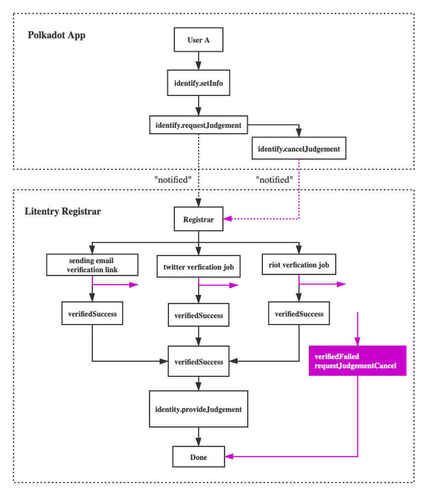

# Implementation Details

Github Repository: [https://github.com/litentry/litentry-registrar](https://github.com/litentry/litentry-registrar)

In this document we highlight the implementation details of how Litentry works as a PolkaDot/Kusama registrar.

## Context

When a user has set their identity in Polkadot or Kusama they can request judgment from a registar. In Polkadot the registar can support up to six levels of confidence in their attestation. At the moment Litentry supports four judgment levels and in the future we would like to support `KnownGood` by integrating with well-known KYC organisations in the future. The `LowQuality` level will never be supported by Litentry.

In the implementation details section, the Litentry Registrar Architecture consists of Validators, Event Listener, ProvideJudgement Service, and Database Service. We also introduce a secure method using JWT (JSON Web Token) to construct the verification protocol.

## Judgement Levels & Criteria

Registrars on Kusama can provide their judgment according to six levels of confidence for users’ identity:

* `Unknown`: The default value, no judgement made yet.
* `Reasonable`: The data appears reasonable, but no in-depth checks (e.g. formal KYC process) were performed.
* `KnownGood`: The registrar has certified that the information is correct.
* `OutOfDate`: The information used to be good, but is now out of date.
* `LowQuality`: The information is low quality or imprecise, but can be fixed with an update.
* `Erroneous`: The information is erroneous and may indicate malicious intent.

There is another temporary confidence level used by Polkadot/Kusama.
* `FeePaid`: The judgement has been requested by a user and the information verification is in progress.

In Litentry we add additional clarification for each of these levels.
`Reasonable` : If a user’s `display name`, `email`, `twitter`, or `element(previously called riot)` identity is verified. Litentry will update the user's identity as `Reasonable`
`OutOfDate` : Litentry registrar keeps track of user's identity to see whether it’s out of date or not updated regularly enough. If a user doesn’t update his identity timely, his identity will degrade to `OutOfDate`. 
`Erroneous`: If any attemp is made by the user user to attack litentry registrar, e.g. DDOS attack, Litentry registrar will provide judgement with `Erroneous` and refuse to provide a new judgment for him in a specific period.

`LowQuality` Litentry registar will never provide a judgement of `LowQuality` Litentry registrar will automatically provide hints to guide the user to update his identity. After all the information is verified correctly, the user will receive a judgment `Reasonable`. In this way, a user can not only save fees (since we only provide one judgement for him) but also save time (since Litentry registrar will point out imprecise or low quality identity as and when it is captured).

At the current phase, Litentry registrar does not support providing a judgement level of `KnownGood` since this would require the cooperation of third-party KYC services. We are working on partnering with the appropriate organisation so that we can support this level in the future.

## Registrar Architecture

The key components of the Litentry registrar are shown as follows. It mainly includes Validators, Event Listener, ProvideJudgement Service and Database Service. Figure1.1 presents the architecture of the Litentry registrar, and Figure1.2 shows the main workflow of the registrar.

Figure 1.1 The Architecture of the Litentry Registrar

The Event Listener listens to all events coming from the Kusama chain. Once a JudgementRequested event is triggered on Kusama and the JudgementRequested indicates to use the Litentry registrar, the Event Listener service will invoke Validators starting the verification process.

At the current stage, the Validators consist of three verification services, Email, Element, and Twitter verification. After receiving the verification request from the Event Listener, the Validator will invoke those verification jobs. They will send a verification link to the users provided accounts and wait for user confirmation from their accounts. As soon as the user confirms all verification links, the ProvideJudgement service will complete the final step, providing judgement for the user. The implementation details will be introduced in the next section.

Once the user proves the ownership of the Email, Element, and Twitter account, the ProvedeJudgement service will send a JudgementGiven transaction on the Kusama to confirm the ownership of the accounts that the user provides.

The Database service will temporarily store users’ data, e.g. Kusama account, email, Element, and Twitter account, so that we can recover services from an unpredictable crash. After completing the verification service, those data will be removed from the server permanently.

Figure 1.2  The main Workflow of Verification process

### Security and Availability

We use JSON Web Token (JWT) to construct the verification protocol. A nonce and an ObjectID (from mongodb) are used to generate the JWT token to ensure security of the Litentry registrar. In this implementation, only the user who requests identity judgement, which implies his/her ownership of this Kusama account, will receive this encrypted token. Malicious users cannot construct this token because of an unknown encryption secret, since nonce and ObjectID are encrypted. And the malicious user has no way to re-play the attacks.

On the other hand, the websocket (TCP connection) can be easily reset by the remote peer due to long-time idle. In this situation, the events from the Kusama would never be captured due to the disconnection between Kusama and Litentry. To prevent this situation, we capture the events from the underlying websocket connection and reconnect to the Kusama automatically whenever the connection is reset by a peer.

### References

1. [Polkadot/Kusama learn identity]<https://wiki.polkadot.network/docs/en/learn-identity#kusama-registrars>
