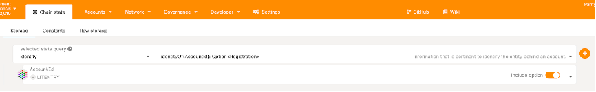
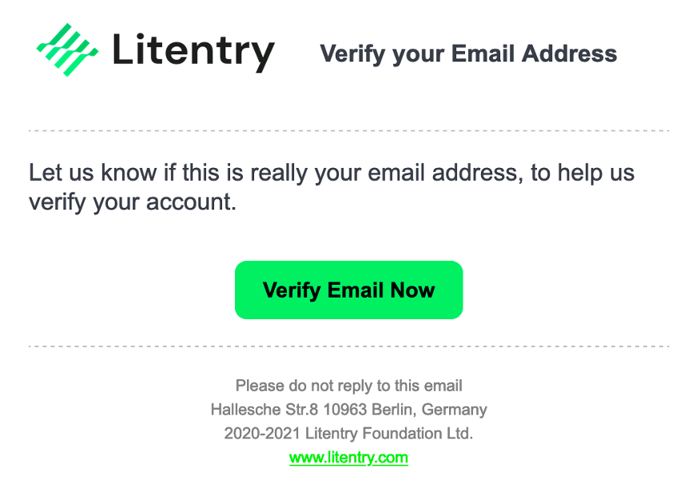
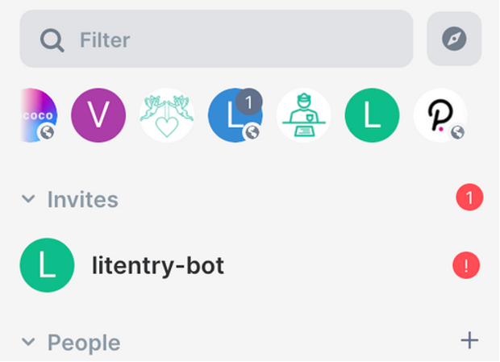
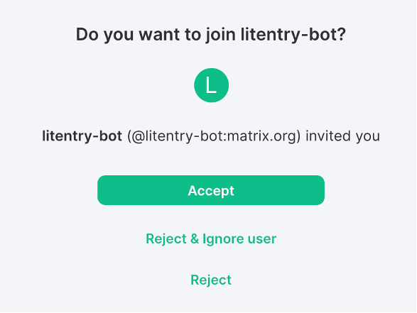
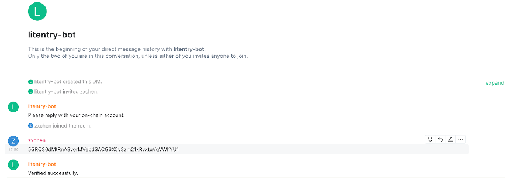
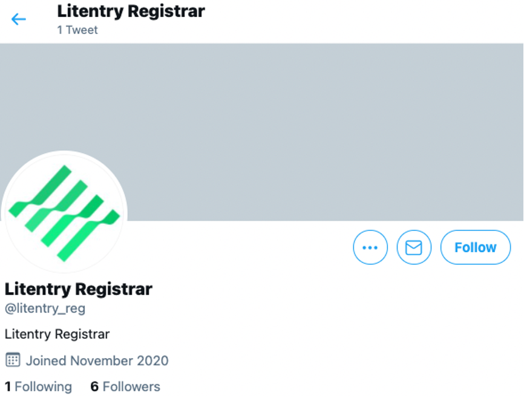
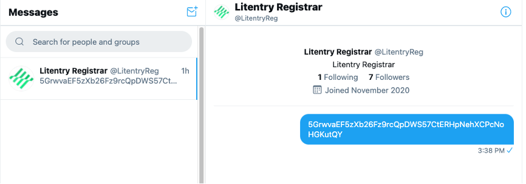

# Litentry Registrar

Github Repository: [https://github.com/litentry/litentry-registrar](https://github.com/litentry/litentry-registrar)

### Introduction 
The user’s account (public key, wallet address) on blockchain can remain anonymous since it is loosely connected with the user's identity. However,  a user with a high reputation can be trusted by the community in the Polkadot ecosystem when he plans to be a validator or a councilor. An on-chain Identity Registrar is a good way to quantify a user’s reputation, e.g. receiving KnownGood or Reasonable from different registrars. 

The objective of the Identity Registrar on Kusama is to verify and certify users’ identities. Currently, W3F provides a registrar service on the chain. However, it suffers from an ineffective workflow (it can take hours to complete the judgement process) since a two-step verification of identity fields needs humans’ intervention. And the fee of a judgement isn’t cheap (0.04 KSM, about 3 ~ 4 dollars). Forthermore, the user has to use polkadot-js to request a judgement, which is not friendly to most end-users. Another annoying problem is that a user cannot check the progress of his judgement in time.

To overcome these problems, the Litentry team provides a registrar service both in the Kusama and Polkadot networks that only one step verification and charges a small fee (0.01 KSM) on Kusama. At the moment, the Litentry registrar focuses on providing judgement with confidence for a user’s `display name`, `email`, `twitter`, or `element name (previously called riot)`.  Besides, the Litentry team will develop an affiliated mobile application to optimize the whole workflow so that  a user completes his judgment request within a few clicks. Be aware that the `display name` cannot be too similar to others that have verified already. There is no need to set all of the fields when using the service. You are free to set whichever field or fields that you like. In most cases,  judgement processes can be finished within 5 minutes. 

### Judgement Levels & Criteria
Officially, registrars on Kusama chain can provide the six levels of confidence for users’ identity:

* `Unknown`: The default value, no judgement made yet.
* `Reasonable`: The data appears reasonable, but no in-depth checks (e.g. formal KYC process) were performed.
* `KnownGood`: The registrar has certified that the information is correct.
* `OutOfDate`: The information used to be good, but is now out of date.
* `LowQuality`: The information is low quality or imprecise, but can be fixed with an update.
* `Erroneous`: The information is erroneous and may indicate malicious intent.
+ `FeePaid`: The judgement is requested by a user and the information is verifying in progress. 

Litentry registrar takes Unknown, Reasonable, OutOfDate, Erroneous as confidence levels, and clarifies criteria for  those judgement levels. 

If a user’s `display name`, `email`, `twitter`, or `element name (previously called riot)` is verified, the Litentry registrar sets the user's identity Reasonable. Furthermore, Litentry registrar will also keep track of users' identity to see whether it’s out of date or not regularly. If a user doesn’t verify his identity timely,  his identity will degrade to OutOfDate.

If a user intends to attack litentry registrar, e.g. DDOS, Litentry registrar will provide judgement with Erroneous and refuses to provide a judgment for him in a specific period. This information can be very useful for other on-chain registrars. They can identify malicious users and refuse to provide services for them to prevent services down.

As for LowQuality, it makes no sense to provide such a judgment for a requested user as a final judgement. Litentry registrar will automatically provide further hints to guide the user to update his identity. After all the information is verified correctly, the user will receive Reasonable. In this way, a user can not only save his fee (since we only provide one judgement for him) but also save his time (since Litentry registrar will point out imprecise or low quality identity timely).

At the current phase, Litentry registrar doesn’t support providing a judgement level of KnownGood since it needs cooperation with third-part KYC services. We’d like to support it with well-known KYC organizations in the future.

### Judgement Process
After a user sets their identity information on chain, they can request a judgement from a registrar. Users declare a maximum fee and the registrar that they are willing to pay and verify for the judgement, and the dedicated registrar can provide a judgement.

#### Setting an On-chain Identity
Go to the Accounts page in Polkadot-JS Apps. The easiest way to add the built-in fields is to click the vertical three dots next to one's account and select "Set on-chain identity".

A popup will appear, offering the default fields.
Currently, the registrar only supports the following fields:

* `display name`
* `email`
* `twitter`
* `element (formerly known as riot)`

Once you have filled in the information you would like to store on-chain, click `Set Identity` to
submit the transaction.

Now you have set the identity information on-chain, but that is not verified yet, so you should see a little gray icon beside your name. 

If you query your identity on the chain, you will find that there is judgement for you. And that’s why the icon beside your name is gray.

It is the time to interact with the Litentry's verification bot by submitting the judgment request to the Litentry’s registrar.

#### Judgement Request
Go to Developer->Extrinsic and select your account to submit the identity -> requestJudgement(reg_index, max_fee) transaction. This will request the registrar to validate the information you set on-chain earlier. The reg_index is the index of the registrar. For Litentry, use XX. The max_fee is the amount of DOT or KSM to pay the registrar. For Litentry use 0.01 KSM.

#### Verification Services
Since we provide the Email, Element and Twitter verification in our registrar at this moment, you will receive verification requests from those platforms. 

##### Email Verification
You should receive an email called "Litentry Verification Service". Below is an example
for reference.

You only need to click the button “Verify Email Now” to complete verification of email address. And you also receive another email that shows your email has been verified successfully.

##### Element Verification

As for Element, an invitation will be sent by the bot named "litentry bot" (see the figure below).

Once you accept the invitation, "litentry bot" asks you to reply with your on-chain account. If the information you replied is correct,  which basically proves you are the owner of the account, 
you should receive another message “Verified successfully” (see the figure below).

If you answer the wrong on-chain account address by mistake, you can reply with another account. (NOTE: Never abuse this functionality. You would receive Erroneous judgement if we identify you as a malicious user).

##### Twitter Verification

To verify your Twitter account, you need to first login the Twitter account you provided previously in the Set Identity step.

After logging in, you need to find Litentry Registrar account by searching for @LitentryReg or simply following the link [https://twitter.com/LitentryReg](https://twitter.com/LitentryReg).

Once you open the profile page of Litentry Registrar, click the “Mail icon” on the left of the “Follow” button to send a Direct Message to it. The content should be your Polkadot account you just used for Set Identity. And after this you just need to wait for a few minutes until your Twitter account is verified by Litentry Registrar.

If everything has been verified successfully, you would see your account verification status has been marked as "reasonable" with a green tick icon on the account.

Congratulations! Your identity should now show as a green "verified" checkmark on Polkadot-JS Apps.

#### Registrar Fee
It is important to notice that no KSM are sent to the registrar at any time. You should NOT send or transfer funds. When calling the requestJudgement, the registrar fee will be locked and put aside. it will be transferred to the registrar only once it finishes its job. After all, we are using a trustless system.

### Reference
1. https://wiki.polkadot.network/docs/en/learn-identity#kusama-registrars
2. https://www.chevdor.com/post/2020/01/17/registrar1/

