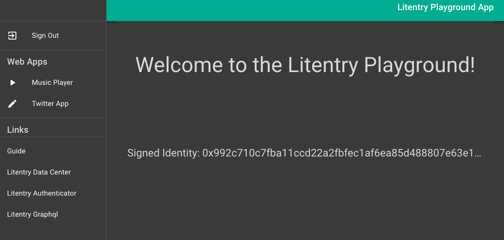
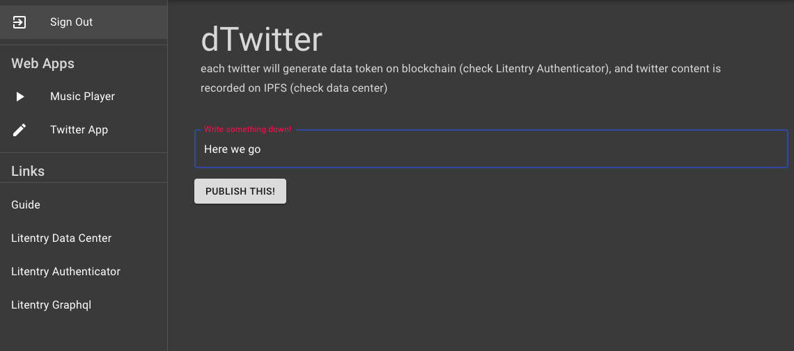

# Litentry DApp Playground
live site on [https://dapp.litentry.com/](https://dapp.litentry.com/)
<!--- <mark>I could not use the Dapp - the guide returned a 404 error and the QRCode did not show in the Sign in form. The litentry data center, litentry authenticator and litentry graphql links all returned errors as well</mark> -->

Repository: [https://github.com/litentry/litentry-web](https://github.com/litentry/litentry-web).

For more information on how to start with Litentry DApp Playground please refer to [this article](https://www.litentry.com/post/play-litentry-dapps-with-ipfs-part-1).<!--- <mark>This article does not exist at this link</mark> -->

Litentry Playground is a hub for decentralized web app applications to achieve Substrate based authentication.

User use Dapps with Litentry decentralized 2FA mobile App. This allows users to use Dapps without registration, passwords and no App migration barriers.

More about the Authentication (Sign in Process):

#### The Object of Litentry Authentication

* It should allow users to use his/her owned Substrate account related identity to login to a third party website (that supports this login method).
* It should be easy to use and reasonably easy to setup.
* It should not compromise the security of the user's Substrate account.
* It should allow users to recover their credentials in case of loss or theft.
* It should not require knowledge of Cryptography or Blockchain with authentication.
* It should have reasonable latency for a login system.
* It should not cost users gas (or money) to login.
* It should be reasonably easy for developers to implement in their apps.

#### The Implementation of Litentry Authentication

1. User on a third party website and click login with Litentry Button
2. A preset account will come if user has logged on with Litentry before in this computer or device, or a QR scanner will come up for user to scan his/her Substrate account QR code.
3. At this time the third party website will send a transaction to Litentry network with a challenge string and its receiver server address. <mark>And sign a JWT with challenge and server address embedded in it.</mark>
4. User now has to open the mobile app <mark>(best integrated with Substrate light client)</mark>. The mobile app has detected the auth request event, the user will authorise the JWT (JSON Web Token)in the mobile application (this signs the transaction using the users private key and then sends the double signed JWT (JSON Web Token) to the server address.
5. The server validates the token received from the user and then finishes the logging process.
6. After the usage of the third party web application or service, third party allocated the user browsing data/history and query the user's data resolver address, then user data is send back to the resolver and being process and harvested into user's own database.

#### Sign in to DApp Playground

#### Star Songs in dSpotify App

#### Record mood with dTwitter App

